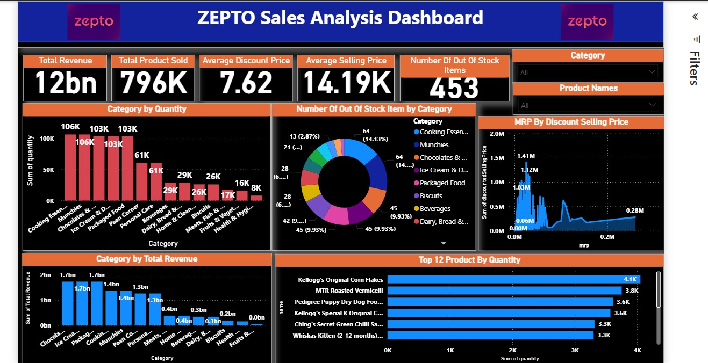

# ZEPTO Dashboard

## Dashboard Preview


## Project Overview
The ZEPTO (Zero Emission Power Technology Operations) Dashboard is designed to provide users with an interactive and comprehensive overview of energy operations, focused on emissions management and analytics.

## Features
- **Real-time Data Monitoring**: View and analyze energy consumption data in real time.
- **Emission Tracking**: Track emissions across various sectors.
- **User-Friendly Interface**: Navigate easily through the dashboard with a clean UI.
- **Custom Reports**: Generate printable reports based on user-defined parameters.

## Installation
To install the ZEPTO Dashboard, follow these steps:

1. Clone the repository:
   ```bash
   git clone https://github.com/yash30000/ZEPTO_Seals-Analysis-Dashboard.git
